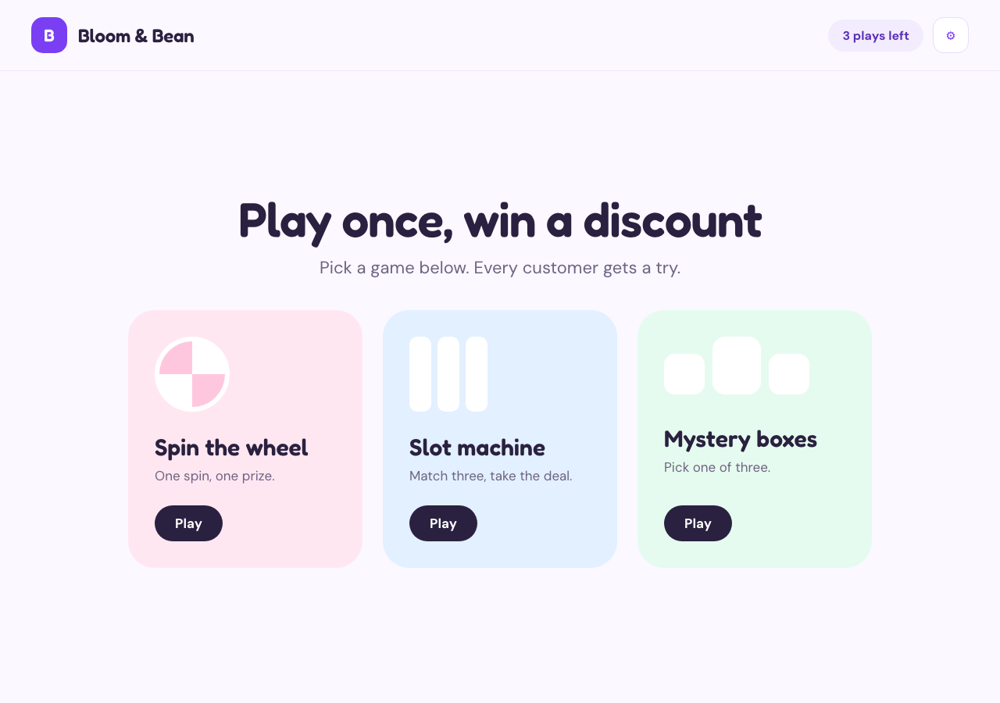

# Kiosk Discount Games

A single-page kiosk screen that lets a customer play a quick game for a store discount.
Three games — **spin the wheel**, **slot machine**, **mystery boxes** — all drawing from
one shared, weighted prize table. Winners get a coupon code with an expiry date.

Everything a store owner would want to change (prizes, win odds, plays per customer,
coupon validity, brand name, accent colour, and all on-screen copy) is editable from the
built-in settings panel behind the ⚙ button, and persists in the browser.



## Live site

https://sachindu-nethmin.github.io/kiosk-discount-games/

## Running locally

No build step, no dependencies — it's plain HTML, CSS and JavaScript.

```bash
python3 -m http.server 8000
# then open http://localhost:8000
```

Opening `index.html` directly from the filesystem works too.

## How it works

| File | Purpose |
| --- | --- |
| `index.html` | Page shell, fonts, favicon |
| `styles.css` | All styling, including the responsive/kiosk-to-phone layout |
| `app.js` | State, prize draw, the three games, settings panel |

**Prize draw.** Every game calls the same weighted draw: odds are summed and a random
point in that range picks the prize, so the odds column does not have to add up to 100 —
it is normalised automatically (the settings panel tells you the running total either way).
A prize counts as a *loss* if its name matches "try again" or "no win"/"no prize".

**The wheel** rotates five full turns plus whatever it takes to land the drawn segment
under the pointer. **The slots** cycle symbols and lock reels left to right, landing on
three matching symbols for a win and a deliberate mismatch for a loss. **The boxes**
resolve to the drawn prize regardless of which box is tapped.

**Plays** are tracked per session and decrement on each result; at zero the play buttons
disable. Changing "plays per customer" in settings resets the counter.

**Settings** are stored in `localStorage` under `kiosk-discount-games.cfg.v1`, so a kiosk
keeps its configuration across refreshes. Clearing site data restores the defaults.

## Deployment

Pushed to `main`, served by GitHub Pages from the repository root. `.nojekyll` keeps
Pages from running the files through Jekyll.

## Credit

Built from a [Claude Design](https://claude.ai/design) canvas.
